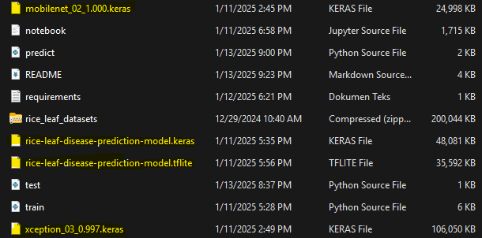

# Rice Leaf Diseases Prediction

### Project Description
In the world today, staple foods like rice are critical to sustaining global populations. Over half the world's population depends on rice, with annual production reaching approximately 480 million metric tons. However, food security remains a major concern as the demand for staple foods continues to rise. Increasing rice production while minimizing losses is essential.

One significant challenge is crop failure caused by plant diseases, especially those affecting leaves. Many farmers suffer financial losses due to these diseases, as they are often diagnosed too late or managed improperly. To address this, machine learning, particularly deep learning, can be employed to predict and diagnose plant diseases effectively. By using this technology, farmers can take timely and informed actions to prevent crop failures and secure their harvests.

The dataset which is going to be use for this project can be downloaded on [this link](https://www.kaggle.com/datasets/maimunulkjisan/rice-leaf-datasettrain-test-and-valid)

### Models
This project is mostly about image classification in deep learning. Some pre-trained models are used, including...
- Xception
- MobileNet
- EfficientNetB2

### Scope
- This project had been done in Saturn Cloud (for running a notebook) and local computer
- Due to computational issues in Saturn Cloud and local computer, I only used Keras for this project

### Files
- README.md
- Dataset in zip folder
- notebook.ipynb (contains EDA, models, final model, and convert model into tf-lite and remove it dependencies)
- train.py
- requirements.txt
- Dockerfile
- test.py
- predict.py

### Dependency 
Since use pipenv is tricky for this project (especially for deep learning model), the dependencies which I used is only requirements.txt. Requirements.txt contains some libraries in Python, including....
```
flask
tensorflow==2.17.0
numpy>=1.23.5
Pillow
waitress
```
This project has been created in Windows OS so make sure to install waitress library. Those libraries would be used to install those libraries via Dockerfile.

### How to run app locally
To run it locally simply run predict.py and then in other terminal, type `python test.py`. You will the result of this prediction

### Model output
For the model output, it should generate like this...

**Note:** I can't upload all those models into GitHub because of those sizes. So if you want to get the output like this, you can run notebook.py or train.py 

### Containerization
The python image which would be used for this project is `python:3.10-slim`. These below are step by step how to make a container in Docker
1. Create a Dockerfile, which contained this code below
    ```
    FROM python:3.10-slim

    WORKDIR /app

    COPY requirements.txt .

    RUN pip install --no-cache-dir -r requirements.txt

    COPY rice-leaf-disease-prediction-model.tflite .
    COPY predict.py .

    EXPOSE 8080

    CMD ["python", "predict.py"]
    ```
2. Build Docker container in terminal
    ```
    docker build -t rice-leaf-disease-pred-tflite-images .
    ```
    After that, check the images does it exist or not by using `docker images`
3. Run the container in terminal
    ```
    docker run -it --rm  -p 8080:8080 rice-leaf-disease-pred-tflite-images:latest
    ```
    After that, you will see that flask development server is running. So if you run `test.py`, it will generate result of the image

### Discussion 
Actually I have tried to deploy this app by using AWS ECR and Lambda and connected it into API gateaway, but I have no idea why it still gave me an error. So that's why I didn't deploy this app to the cloud

### References
Muthayya, et al. (2014). An overview of global rice production, supply, trade, and consumption. *Annals of the New York Academy of Sciences, 1324*(1), 7–14. https://doi.org/10.1111/nyas.12540